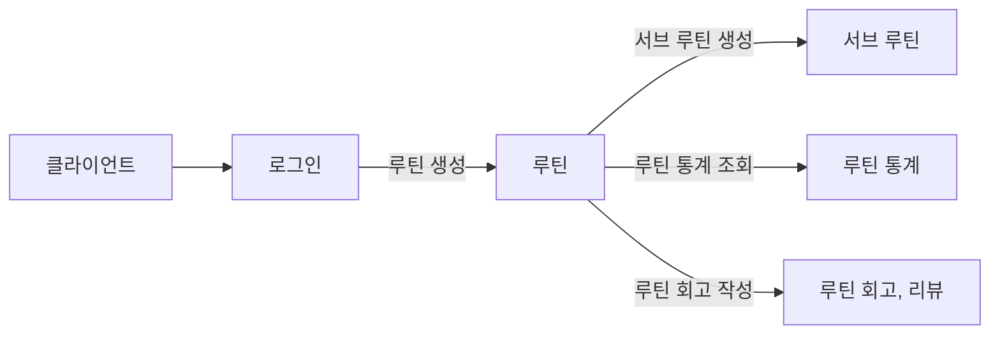

# routine-app-BE


### 🏃 유저 스토리



### 📦 ERD


### 🤔 고민


#### 1️⃣ 루틴 통계 테이블

  `루틴 통계 테이블` 을 따로 두어 일정 기간루틴의 연속 성공 횟수, 누적 성공 횟수등의 정보를 저장해두는 것이 좋을까?

  아니면, 매 요청마다 루틴에 대한 모든 정보를 계산해주는게 좋을까?

  데이터베이스에 직접 저장된 통계 정보를 사용하는 경우

    1. 계산 부담: 매번 요청이 들어올 때마다 실시간으로 통계를 계산하는 것은 서버에 계산 부담. 
       특히 사용자가 많고 데이터가 많은 경우에는 서버 부하가 증가할 수 있다.
    2. 일관성: 데이터베이스에 저장된 통계 정보를 사용하는 경우 데이터 일관성이 보장. 
       하지만 실시간으로 계산하는 방식은 클라이언트가 서버에게 요청할 때마다 새로운 계산을 수행하므로 데이터 일관성에 대한 우려 발생
    3. 시간 지연: 클라이언트에서 매번 요청할 때마다 통계를 계산하는 경우 일정한 시간 지연이 발생
       하지만 데이터베이스에 저장된 통계 정보를 사용하는 경우에는 이러한 지연이 발생하지 않는다..

  따라서 실시간으로 통계를 계산하여 클라이언트에게 제공하는 방식은 간단하고 빠르게 구현할 수 있지만, 서버 부하와 데이터 일관성에 대한 고려가 필요합니다. 사용자 수나 데이터 양이 많은 경우에는 데이터베이스에 저장된 통계 정보를 사용하는 것이 더 효율적일 것 같다.

  `루틴 통계 테이블`을 따로 두어 구현시, 지난 주의 해당 루틴에 대한 통계 정보와 이번 주의 루틴에 대한 통계 비교를 어떤식으로 구현을 해야 할까?

#### 2️⃣ **DB Time Type**

  `TIME` 및 `TIMESTAMP`은 둘 다 시간을 저장하는 데이터 유형이지만, 각각 다른 용도로 사용된다.

    1. TIME:
        - TIME 데이터 유형은 시간을 나타냅니다. 일반적으로 하루의 특정 시간을 나타내기 위해 사용된다. 따라서 시, 분, 초의 정보만을 저장하며, 날짜 정보는 포함하지 않는다.
        - 루틴의 시작 시간과 같이 날짜가 중요하지 않고, 단순히 시간 정보만 필요한 경우에 사용될 수 있다. 예를 들어, 루틴이 매일 같은 시간에 시작한다면 TIME 데이터 유형으로 시작 시간을 저장 가능.
    2. TIMESTAMP:
        - TIMESTAMP 데이터 유형은 날짜와 시간을 모두 저장합니다. 즉, 연, 월, 일, 시, 분, 초의 정보를 포함.
        - 루틴 생성일이나 통계 생성일과 같이 날짜 및 시간 정보가 모두 필요한 경우에 사용. TIMESTAMP를 사용하면 날짜 및 시간을 완전히 저장할 수 있어서 데이터를 정확하게 추적하고 분석하는 데 유용

  따라서 TIME은 시간 정보만을 저장하고, TIMESTAMP는 날짜 및 시간 정보를 모두 저장한다는 차이가 있다.   
  루틴의 시작 시간을 TIME으로 저장하고, 생성일과 같은 일반적인 일시 정보를 TIMESTAMP로 저장하여 데이터를 효율적으로 관리하고 의미를 명확하게 하자.


#### 3️⃣ 루틴의 연속 수행 횟수와 누적 수행 횟수에 대한 데이터를 따로 분리해야 할까?
    - 결국 루틴의 성공 여부에 따라 해당 데이터의 값이 변경될 것이라고 생각했다.
    - 따라서, 성공이라는 값으로 업데이트 될 때, 연속 수행 횟수와 누적 수행 횟수에 대한 증감 로직을 처리하는게 깔끔하다고 생각했다.

  따라서, 루틴 테이블에 해당 정보를 추가하고 관리하도록 했다.

#### 4️⃣ 서브 루틴을 하는 소요시간은 사용자가 직접 입력을 해주는 것인가?

  💡 서브 루틴을 수행하고 사용자가 직접 소요된 시간을 입력

  💡  서브 루틴 수행 시작 버튼 → 완료 버튼 을 누르면 그 사이의 소요된 시간을 서버에서 계산

    - 이 부분은 이야기를 해봐야할 것 같다.

  일단은 직접 소요된 시간을 입력하는 형식으로 코드를 작성하기로함


#### 5️⃣ 루틴의 성공, 실패, 넘어감 에 대한 상태 정보를 기간별 조회에 대해서 어떤 식으로 처리를 해야 할까?  

원래는 **`루틴 통계`** 엔티티를 **일주일 기간**의 루틴의 정보만을 저장해놓고자 했다.
    
    - 매주 월요일 00:00 시에 배치를 통해서 이를 초기화 해주는 방식
    

⚠️ figma 를 보니 월별 조회가 있었다.
    
    (ex: 2024년 4월 조회) 
    
이런 조회에 대해 위의 방식을 사용했 때는 보여줄 수가 없을 것 같다.
    
    ❗`루틴 성공(실패) 상태` 에 대한 테이블을 만들어서 이를 해결해보는건 어떨까?
    
    - 루틴이 성공했을 경우에만 테이블에 데이터를 추가할까?
    
    - 기간별 조회를 많이 한다.
        - 따라서, date에 `index`를 설정해두면 어떨까?
    
    - 서브 루틴들이 모두 완료가 되면 `Event` 를 발생시켜 성공 기록에 대한 데이터를 추가❓

#### 6️⃣루틴을 성공 또는 실패 같은 처리를 했을 때, 다시 상태를 되돌릴 수 있나?

  **💩만약, 루틴을 실패 처리를 했을 경우에 루틴 필드의 루틴 연속 카운트를 0으로 만들어주고자 한다.**

  이때, 실패된 루틴을 다시 성공처리로 변경할 수 있다면, 이전까지의 연속 카운트를 알고 있어야 다시 리셋을 해줄 수 있을 것이다.


### ❓궁금한 점

#### 1️⃣ 실패 루틴과 건너뛴 루틴의 차이점은 무엇인가

  정해진 기간에 해야할 루틴을 건너뛴 것이 실패한 것이 아닌가?

  두 가지 경우의 다른점을 무엇으로 봐야할까?

  

#### 2️⃣ 루틴의 성공 조건은 무엇이고 성공에 대한 처리는 어떤 식으로 해주어야 하나?

  **🎯 성공 조건**

    - 모든 서브 루틴이 성공이 되어야 루틴이 성공인 것일까?

  **📍 성공 처리**

    - 모든 서브 루틴이 성공 되었을 때 자동으로 해당 루틴이 성공 상태로 변해야 할까?
    - 사용자가 직접 루틴에 대한 성공 처리를 해주어야 할까?

  ⇒ 모든 서브 루틴이 성공되었을 때,  `Event` 를 발생시켜 성공 기록에 대한 데이터를 추가해주자❓

    - 따로 루틴 엔티티에서 루틴의 성공상태에 대한 필드를 가지고 있지 말자
    - 만약, 당일 루틴의 성공 여부를 알고 싶다면, front에서 서브 루틴의 성공 여부에 따라서 루틴의 성공 여부에 대한 표현이 토글로 처리되도록 하는건 어떤지?

#### 3️⃣ 루틴 통계 조회시, 이번주와 저번주에 대한 기록이 필요하다.

  주의 `시작`과 `끝`은 무슨 요일로 정할 것인가?

  💡 **일단, 월요일 - 일요일 을 주의 시작과 끝으로 정하고 코드를 작성했다.**


### ☑️ API 명세

#### 🖥 루틴 일주일 기록 조회 Response

```json
{
  "code": 200,
  "message": "API 요청이 성공했습니다.",
  "result": [
    {
      "routineId": 1,
      "routineGoal": "",
      "completedRecord": {
        "status": "COMPLETED",
        "count": 0,
        "dates": []
      },
      "failedRecord": {
        "status": "FAILED",
        "count": 0,
        "dates": []
      },
      "skippedRecord": {
        "status": "SKIPPED",
        "count": 0,
        "dates": []
      }
    }
  ]
}
```